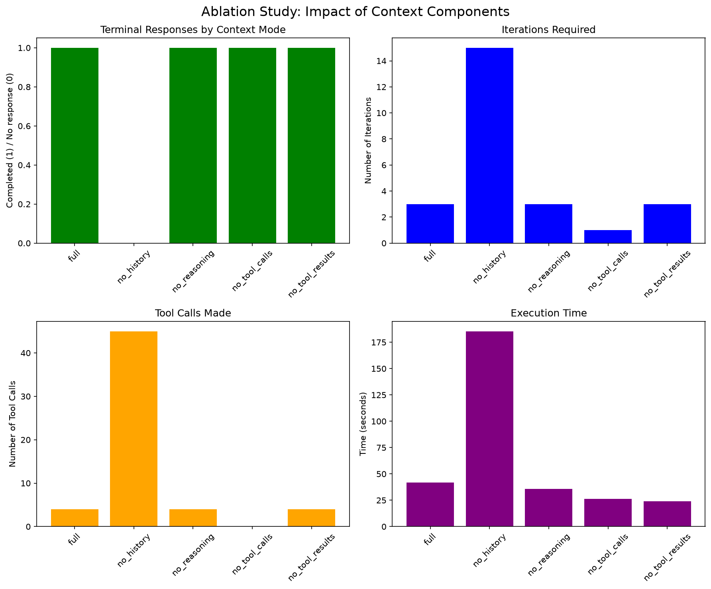
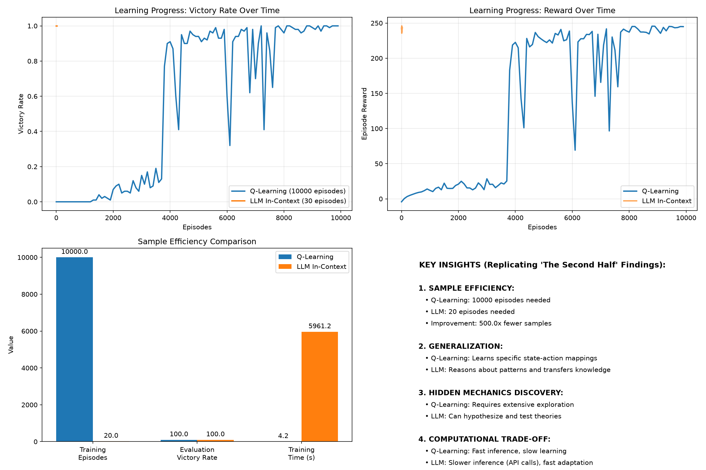

# 第 1 章实验总结

本目录是第 1 章五个实验项目的**运行产出归档**（代码在原仓库 `ai-agent-book/chapter1/`，这里只保留结果）。

> 🎯 **范围约定**：本章实验**全部用国内模型完成**——DeepSeek、Kimi(Moonshot)、阿里 DashScope 直连，
> 未使用 OpenRouter、Gemini、GPT。凡需要国外模型的路线（如 1-4 的 `native` / `native_gptimage`）
> 属**主动暂缓**，等后期实战真正用到时再补。因此下文出现的「只跑了某条路线」
> 是范围选择的结果，不是配置失败。

---

## 一、总览

| 目录 | 书中实验 | Provider / 模型 | 状态 | 主要产出 |
|---|---|---|---|---|
| `context/` | **1-1** ★★ 上下文的关键作用 | kimi / default | ✅ 15 种模式全跑完 | `ablation_study_report.md`、`ablation_results.json`、2 张图 |
| `web-search-agent/` | **1-2** ★ Kimi K3 原生 Agent | Moonshot 直连 | ⚠️ 3 问中完成 2 问，第 3 问手动中断 | `result.log` |
| `search-codegen/` | **1-3** ★ 原生 Deep Research | dashscope / `qwen3.7-plus` | ✅ **验收指标全过** | `result.json`(89 KB)、`result.log` |
| `image-gen-workflow/` | **1-4** ★ 文生图工作流 | Kimi 改写 + 万相生图 | ✅ **5/5 成功** | 5 张图 + 20 份调用证据 |
| `learning-from-experience/` | **7-1 / 7-2**（代码在第 1 章树内） | dashscope / `qwen3.7-plus` | ✅ RL + LLM 双臂完成 | 对比图、`experiment_results.json`、`llm_experiences.json`(5.6 MB) |

> ⚠️ **注意最后一行**：`learning-from-experience` 的**代码位于第 1 章项目树，但对应书中实验 7-1**
> （项目 README 原话：「代码位于第 1 章项目树；对应书中 实验 7-1 ★」），同时被第 8 章的
> `EXPERIMENT_LEDGER.md` 引用。它不是 1-x 系列实验，别按第 1 章的编号去找它。

---

## 二、配置要点（踩过的坑，复现前必读）

这一节是本章最值钱的部分——四个项目里有三个的默认配置在国内网络下**跑不通**。

### 1. `DASHSCOPE_BASE_URL` 的后缀在 1-3 与 1-4 之间互相冲突

同一个环境变量，两个实验要求的后缀不同，**不能写进全局 `.env`**，必须跑时临时传：

| 实验 | 代码拼接方式 | 必须的后缀 |
|---|---|---|
| **1-3** `search-codegen` | `{base_url}/responses` | **`compatible-mode/v1`** |
| **1-4** `image-gen-workflow` | `{base_url}/services/aigc/text2image/image-synthesis`、`{base_url}/tasks/{id}` | **`api/v1`** |

两个项目默认值都指向**国际站** `dashscope-intl.aliyuncs.com`，而国内站与国际站是**两套独立账号、key 不通用**。
报 `InvalidApiKey` 时先检查站点是否匹配，而不是怀疑 key 写错。

### 2. 1-3 不能用 Kimi，也不能用第三方中转

`code_interpreter` 与 `web_search` 是 **OpenAI Responses API 的托管工具**，沙箱运行在厂商服务端。
用 Kimi 的自定义 `OPENAI_BASE_URL` 会直接报：

```
invalid_request_error: responses: unsupported tool type: "code_interpreter"
```

`main.py` 的 `--backend` 只有 `openai / openrouter / dashscope` 三个选项，**国内唯一出路是 `dashscope`**
（阿里百炼支持 Responses API 托管工具）。这一点已被本次运行证实——见下方 1-3 的 `x_billing_type: response_api`。

### 3. 1-4 只配 Kimi + DashScope 会直接退出

`main.py` 无条件调用 `Config.validate()`（**早于任何 `--route` 分支**），而 `required_env()` 返回**四个** key：
`KIMI_API_KEY`、`DASHSCOPE_API_KEY`、`GEMINI_API_KEY`、`OPENAI_API_KEY`。

解法：`validate()` 只检查非空、不校验有效性，所以给用不到的两个填占位值，并**显式指定路线**：

```bash
export KIMI_API_KEY=$MOONSHOT_API_KEY   # config.py 有 `or MOONSHOT_API_KEY` 兼容
export GEMINI_API_KEY=dummy             # 占位
export OPENAI_API_KEY=dummy             # 占位
DASHSCOPE_BASE_URL=https://dashscope.aliyuncs.com/api/v1 \
  python main.py --route workflow       # 默认是 all，会真去调 Gemini（国内不可达）
```

三条路线中只有 `workflow`（Kimi 改写 + 万相生图）在国内可行；`native` 要 Gemini、`native_gptimage` 要中转站支持生图接口。

### 4. `GEMINI_API_KEY` 必须留空（本章全部实验适用）

gemini provider 没有 `base_url_var`，**无法改道**。一旦填了 key，解析层会直连
`generativelanguage.googleapis.com`（国内不通）；留空反而会兜底到可用通道。

---

## 三、各实验详情

### 1-1 上下文的关键作用（`context/`）

**做法**：在一个需要 PDF 解析 + 汇率转换 + 计算的复杂金融任务上，逐个摘除上下文组件，共测 **15 种模式**。

| 摘除的组件 | 结果 | 迭代数 | 耗时 |
|---|---|---|---|
| `NO_HISTORY`（历史工具调用） | ❌ **无终止响应** | 15（触顶） | 165.7 s |
| `NO_REASONING`（推理过程） | ✅ 完成 | 3 | 35.65 s |
| `NO_TOOL_CALLS`（工具调用指令） | ✅ 完成 | 1 | 26.46 s |
| `NO_TOOL_RESULTS`（工具返回结果） | ✅ 完成 | 3 | 24.13 s |
| **完整上下文**（基准） | ✅ | 平均 4 次工具调用 | 平均 41.44 s |

**统计**：15 次测试中只有 **5 次产生终止响应**；其中 `no_tool_calls` 与 `no_tool_results` 两臂
**明确声明自己给出的数字不可支撑**。

> 🔑 **这份报告最值得注意的地方是它的自我克制**：原文写明「a terminal response is not evidence that
> the financial task was completed」——**跑完了 ≠ 做对了**。摘掉工具后模型照样能流畅地输出一份
> 看起来像样的金融分析，这正是「静默降级」的危险之处。
> 任务级正确性要用 `run_experiment_1_1.py` 的 canonical numeric rubric 单独裁定。



### 1-2 Kimi K3 原生 Agent 能力（`web-search-agent/`）

**做法**：`python examples.py` → 选示例 6「研究助手 - 深度研究」，主题为「大语言模型的发展历程」，含 3 个递进研究问题。

| 研究问题 | 结果 | 迭代 | `web_search` 调用 | 耗时 |
|---|---|---|---|---|
| 1. 详细定义 | ✅ 成功生成答案 | 2 轮 | 4 次 | ~2.5 min |
| 2. 关键里程碑 | ✅ 成功生成答案 | 3 轮 | 5 次 | ~1.75 min |
| 3. 主要挑战 | ⚠️ **第 3 轮时 Ctrl+C 中断** | — | 已发出 5 次 | — |

端点全程为 `https://api.moonshot.cn/v1/chat/completions`，**国内站直连成功**，未走任何中转。
输出质量可见于 log：第 2 问自动梳理出从 1950 年图灵测试、1966 年 ELIZA、2003 年神经语言模型到
Transformer / BERT / RLHF 的七阶段时间线。

> ⚠️ **未完成项**：第 3 问是手动中断的（log 末尾 `^C`），不是报错。单个问题耗时 2–3 分钟，
> 三问全跑约需 8 分钟；如需完整证据链，重跑时不要中途打断。

### 1-3 原生 Deep Research 能力（`search-codegen/`）

**命令**：

```bash
python main.py --backend dashscope --mode single \
  --request "东盟 10 国首都之间最近的一对是哪两个？请搜索并用 Python 计算" \
  --output result.json
```

**结论**：吉隆坡（马来西亚）↔ 新加坡，Haversine 球面距离 **315.29 km**。

**验收指标（从 `result.json` 实测提取）**：

| 指标 | 值 | 判定 |
|---|---|---|
| `success` / `error` | `True` / `None` | ✅ |
| `status` | `completed` | ✅ |
| `provider` / `base_url` | `dashscope` / `https://dashscope.aliyuncs.com/compatible-mode/v1` | ✅ 国内站 + 正确后缀 |
| `model` == `requested_model` | `qwen3.7-plus` == `qwen3.7-plus` | ✅ **model_identity_exact** |
| `output_items` | 6 项 = reasoning×3 + **web_search_call×1** + **code_interpreter_call×1** + message×1 | ✅ |
| `tool_calls` 状态 | 两个均为 `completed` | ✅ **工具闭环成立** |
| `citations` | **91 条**（阈值 ≥2） | ✅ |
| `usage.x_tools` | `{code_interpreter: 1, web_search: 1}` | ✅ 阿里计费侧交叉印证 |
| `usage.x_billing_type` | **`response_api`** | ✅ 确认走 Responses API |
| tokens | input 20030 / output 4615 / **reasoning 2454** / total 24645（cached 8704） | — |
| `elapsed_seconds` | 114.94 s | — |

> 🔑 **这是本章最关键的一次验证**。`validate_asean` 的设计原则是**不信任正文文本**——
> 因为即使工具没被调用，模型也可能生成一份流畅且数字碰巧正确的报告（静默降级）。
> 它只认四个硬信号：`tool_calls` 的类型与状态序列、`citations` 数量、`usage.x_tools` 计数、
> 以及正文数字与沙箱日志逐字一致。**本次运行四个信号齐全，是真闭环，不是侥幸。**
>
> 另注：`temperature_omitted_for_reasoning_model: True` —— 推理模型不接受 temperature 参数，代码自动省略。

### 1-4 文生图工作流与原生图像生成（`image-gen-workflow/`）

**运行**：`run_id=20260914T180617Z`，5 句需求 × 路线 `['workflow']`，**5/5 成功**。

| 场景 | 需求原文 | 输出大小 |
|---|---|---|
| `programmer-overtime` | 帮我画一个周末加班的程序员，风格丧一点 | 1,053,043 B |
| `windowsill-plant` | 帮我画一盆放在窗台上的绿植，早晨的阳光刚好照进来 | 1,236,232 B |
| `headphone-poster` | 帮我做一张新款降噪耳机的产品海报，主打"深夜独处也清净"这句文案，风格简约高级 | 954,742 B |
| `agi-programmer` | 帮我画一个 AGI 实现以后程序员的工作场景 | 1,197,623 B |
| `future-city-morning` | 帮我画一幅"未来城市的早晨"的画 | 1,283,217 B |

**流水线的两个节点**（每个场景在 `outputs/.../calls/` 留下 4 份证据）：

1. `*_rewrite_*.json` — **Kimi 改写节点**，把口语需求扩写成生图提示词（~2.8–3.1 KB）
2. `*_image_generate_*.json` ×3 — **万相生图节点**，`wan2.2-t2i-flash`；三份记录分别对应
   提交任务 / 轮询 / 下载 OSS 图片，最后一份的 `endpoint` 是 `dashscope-5859.oss-cn-wulanchabu-acdr-1.aliyuncs.com` 的 PNG 直链，
   `status: ok`、`latency_ms: 535.9`、`response_bytes: 1236232`

证据清单：`validation/real_20260914T180617Z/evidence.json`，
`sha256: 3705b553cbc751dce4cb34ecfb27377552d7eae34e6947efe3e4ef72f7083ba6`

> 📌 本次只跑了 `workflow` 路线（Kimi 改写 + 万相生图），按范围约定**主动跳过** `native`（Gemini）与
> `native_gptimage`（GPT）两条原生对照臂，后期实战需要时再补。实验的核心结论
> （适配层把异构生图 API 内化为统一节点）在 workflow 路线上已完整体现，不影响本章学习目标。

### 7-1 / 7-2 从经验中学习：RL vs LLM（`learning-from-experience/`）

在一个**带隐藏机制的寻宝游戏**上对比表格式 Q-learning 与 LLM 上下文学习。共 4 次运行，
其中 2 次失败/中断（`20260915_021840` 只剩 pkl、`20260915_025727` 是空目录），有效的是：

| 运行 | 命令 | 内容 |
|---|---|---|
| `20260915_021600` | `--mode qlearning --rl-episodes 10000 --seed 42` | 仅 RL 臂 |
| `20260915_025754` | `--mode both` | **RL + LLM 双臂，本节数据以此为准** |

**双臂对比（`20260915_025754` 实测）**：

| 指标 | Q-learning | LLM In-Context |
|---|---|---|
| 训练局数 | **10,000** | **20** |
| 评估局数 | 100 | 10 |
| 评估胜率 | **100%** | **100%** |
| 训练期胜率 | 54.98%（5498/10000） | 100%（20/20） |
| 评估平均步数 | 13.0 | **12.6** |
| 评估平均奖励 | 244.5 | 243.15 |
| **耗时** | **4.20 秒** | **5961 秒（99.4 分钟）** |
| Token 消耗 | 0 | **1,182,827** |
| Q 表 / 经验条数 | 143 状态 | 79 条经验 |
| API 调用 | — | 409 次，**0 错误**，2 次 fallback |
| 端点 | 纯本地 | `dashscope` / `qwen3.7-plus`，`compatible-mode/v1`，`using_openrouter: False` |

**核心发现**：

1. **样本效率差 500 倍**：LLM **第 1 局就通关**（16 步、奖励 241.0，已接近 RL 收敛后的 244.5）；
   Q-learning 训练 10,000 局，评估时才达到 100%。
2. **时间成本反向差 1419 倍**：RL 用 4.2 秒做完的事，LLM 花了 99.4 分钟——
   瓶颈是**每步一次串行阻塞的 API 调用**（409 次调用 / 30 局 ≈ 每局 13.6 步）。
3. **LLM 主动发现隐藏机制**：通过试错（锈剑失败 → 合成银剑成功）推断出颜色锁与自动钥匙触发规则，
   而 RL 只能穷举状态-动作映射。轨迹细节见 `llm_experiences.json`（5.6 MB）。
4. **两次 RL 运行的收敛点不一致**（都值得注意）：

   | 窗口 | `021600`（seed=42） | `025754` |
   |---|---|---|
   | 3000 局 | 0.1% | 0.5% |
   | 4000 局 | 0.1% | **17.2%** |
   | 5000 局 | 0.1% | **81.8%** |
   | 6000 局 | **55.9%** | 92.3% |
   | 7000 局 | 97.0% | 79.2%（回落） |
   | 10000 局 | 98.1% | 98.7% |

   即便固定 `seed=42`，**Q-learning 的突破点在 4000–6000 局之间漂移**，且 7000 局处出现过 92.3%→79.2% 的回落。
   ε 衰减到下限 0.1 后仍会波动——**单次运行的学习曲线不足以支撑结论，应多跑几个 seed 取平均**。



---

## 四、横向观察

把五个实验放在一起看，第 1 章其实在反复演示同一件事：**Agent 的能力边界由「上下文 + 工具」共同决定，而不是由模型单独决定。**

- **1-1 从反面证明**：摘掉 history / tool_results 后，模型仍能产出流畅文本，但要么打转 15 轮不终止，
  要么自己承认数字不可支撑。**5/15 的终止率**就是这个论断的量化。
- **1-3 从正面证明**：同一个「搜索 + 计算」任务，交给托管工具闭环后 114.94 秒拿到 91 条引用与可复算的
  Haversine 结果，且**验收只认工具调用证据、不认文本**。
- **1-2 与 1-3 的对照**：两者都叫「web search」，但机制完全不同——1-2 是 Kimi **内置**工具
  （Chat Completions），1-3 是 OpenAI **Responses API 托管**工具（服务端沙箱）。
  **把 1-2 的 Kimi 配置拿去跑 1-3 必然报 `unsupported tool type`**，这是本章最容易踩的坑。
- **1-4 把工具换成生图 API**：Kimi 改写 + 万相生成，两节点串成流水线，适配层屏蔽了异步任务轮询与 OSS 直链下载。
- **7-1/7-2 把「经验」本身作为变量**：LLM 靠语言先验第 1 局通关，RL 靠 10,000 局穷举——
  但代价是 118 万 token 与 1419 倍的时间。**样本效率与推理成本的权衡，是这条主线的落点。**

---

## 五、文件清单

```
chapter1/
├── README.md                          ← 本文件
├── context/                           1-1
│   ├── ablation_study_report.md       人读报告（15 模式、含自我克制声明）
│   ├── ablation_results.json          原始数据 (10.8 KB)
│   ├── ablation_study_results.png     消融结果图
│   └── ablation_from_validation.png   官方 validation 对照图
├── web-search-agent/                  1-2
│   └── result.log                     3 问运行日志（第 3 问 ^C 中断）
├── search-codegen/                    1-3
│   ├── result.json                    完整响应 + 验收字段 (89 KB)
│   └── result.log                     终端输出（含答案与 token 统计）
├── image-gen-workflow/                1-4
│   ├── result.log                     5/5 成功 + manifest/sha256
│   └── outputs/20260914T180617Z/
│       ├── images/                    5 张成图（各 ~1 MB）
│       └── calls/                     20 份调用证据（5 rewrite + 15 image_generate）
└── learning-from-experience/          7-1 / 7-2
    ├── result.log                     qlearning 单臂运行日志
    └── results/
        ├── 20260915_021600/           RL 单臂（seed=42）
        ├── 20260915_021840/           ⚠️ 不完整（仅 pkl）
        ├── 20260915_025727/           ⚠️ 空目录（失败运行）
        └── 20260915_025754/           ✅ 双臂完整产出
            ├── comparison_plots.png   四子图对比
            ├── experiment_results.json  数值汇总 (451 KB)
            ├── llm_experiences.json   LLM 全部轨迹 (5.6 MB)
            └── rl_agent.pkl           训练好的 Q 表
```

---

## 六、待补项

### 6.1 真正要补的（与模型来源无关，国内模型即可完成）

| 项 | 说明 | 成本 |
|---|---|---|
| 1-2 第 3 问 | 手动中断（log 末尾 `^C`），非报错 | 重跑约 3 分钟 |
| 1-1 任务级正确性 | 当前只有行为指标（终止率、迭代数），缺任务对错裁定 | 跑 `run_experiment_1_1.py` 的 numeric rubric |
| 7-1/7-2 多 seed | RL 收敛点在 4000–6000 局间漂移，单次曲线不足以下结论 | 补 3–5 个 seed，RL 臂每次仅 ~4 秒 |
| 清理失败运行 | `20260915_021840`（仅剩 pkl）、`20260915_025727`（空目录） | 可直接删 |

### 6.2 主动暂缓（需国外模型，等后期实战再做）

| 项 | 缺什么 | 备注 |
|---|---|---|
| 1-4 `native` 路线 | Gemini 原生图像生成 | `GEMINI_API_KEY` 保持留空（原因见二、4） |
| 1-4 `native_gptimage` 路线 | 支持 `images/generations` 的 GPT 中转 | 多数中转站不提供该接口 |

> 这两项**不影响第 1 章的学习目标**：1-4 要演示的是「适配层把异构生图 API 内化为统一工作流节点」，
> `workflow` 路线（Kimi 改写 → 万相生图 → OSS 取图）已经把这条链路完整走通了。
